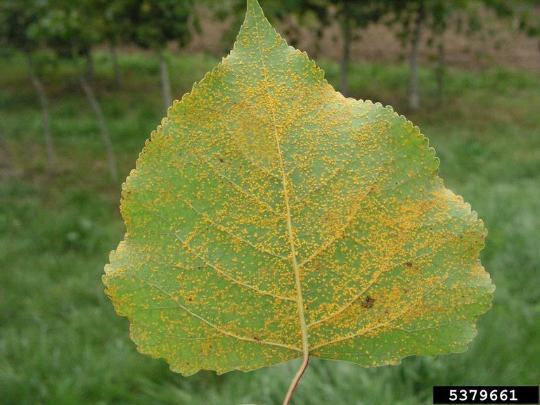
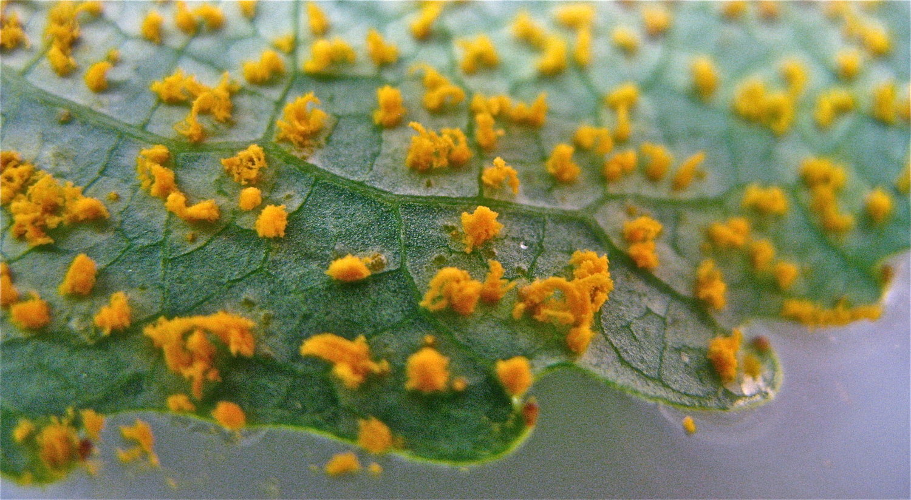

# Quantitative Genetics: Identifying the key genes that control resistance

## 🧇 Brief Description

My study focuses on *Populus nigra* species, or in a common name called black poplar.
It is a native species that is spanning across European countries. 

I had 154 poplars sampled from various populations in Western Europe. Their condition in
Western Europe is particularly threatened by pathogen attacks. The pathogen causes yellow
spots on the poplar leaves which can reduce poplar's growth and economic income. 

  
  <em>The representation of the pathogen attacks on a poplar's leaf</em>

  
  <em>The microscopic view of the disease</em>

## 🧇 Objectives

* Because the pathogen attack causes reduction in economic income from poplar's plantation, I would
like to check if *there is resistance* in poplar individuals.
* If there is a resistance, I wanted to depict its genetic control. This is because I wanted to make
sure that the resistance can be inherited to the next generation.
* I infected 154 poplars with 3 pathogen types (codes: 09AX27, 93JE3, and P72) because I wanted to
see the interaction between poplars and the pathogens. This is to see if poplars' resistance depends
on the types of the pathogen that the poplars are interacting with.

## 🧇 Variables

* Resistance is measured through *latent period, uredinia number and uredinia size*. I called these
*resistance components*

Some explanations:
* Latent period: the time needed by poplars to start **showing the very first infection in terms of spore**
(measured in days)
* Uredinia number: the total number of spores found on poplar leaves (measured in counts)
* Uredinia size: the size of the spores found on poplar leaves (measured in score with scale 1 - 5; 1 being
smallest, 5 being the largest)

## 🧇 Methods / Working pipeline

**Data collection**

I conducted preliminary analysis to understand the distribution of the raw data, to evaluate the block effects
to the variation of the resistance components, and to get the average values from across the blocks.

Before I continue, just a kind reminder that I conducted laboratory experiment to collect the data.

In the lab, I have 154 poplar leaves infected with 3 pathogen types. Then all these infected leaves were
replicated 5 times (I call them *blocks*). D

uring a period of 14 days, I measured the resistance components.
I had to make sure that blocks do not have significant effects on the variation in my resistance components.
Because if they do, it 'pollutes' my analysis results. I wanted to be sure that the variation in my resistance
components 'purely' came from the variation in poplar individuals. 

----

**Observing the resistance in black poplars**

After getting the average values from across the experimental blocks, I conducted Exploratory Data Analysis to
observe the behaviors of the poplars when they were infected by different pathogens. This allowed me to
conclude if the poplars are resisting or not.

----

**Depicting the genetic control of resistance** 

I ran Genome-Wide Association Model to find the association between poplar's genes and resistance components.

Besides the data that I collected from the laboratory, I also had genomic data. Genomic data contains the
whole genes of an individual, in this case poplar. I ran this model where the resistance components were 
the response variable, the genomic data is the main factor (or explanatory variable), and population structure
and relationship between individuals are the correction factor. 

The association model is basically a marginal model being run for each gene. So if there are many genes, there
will be many association model. I had to classify which genes that are related to the resistance components
and which are not. So, I defined a threshold.

The results would be the total of genes that are significantly associated with the resistance components.

----

**Interaction between the poplars and the pathogens**

This is crucial to see if the expression of the resistance depends on the types of the pathogens that the poplars
are interacting with. It either gives us the idea of local adaptation or the specific requirements for the
resistance to show. 

I used mixed-effects model where resistance components are the response variables, poplar individuals and 
interaction are the main factors, and population structure and relationship between individuals are the
correction factors. 

----

## 🧇 Results
